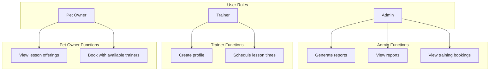

# LTS Scheduling & Booking System — Planning Document

## 1. Executive Summary

**Legendary Training Services (LTS)** provides pet training services and wants to automate scheduling and booking. The system will support **classes** and **individual training sessions**, with distinct experiences for admins, trainers, and pet owners. The project delivers a web application plus course-required documentation (SOW, user stories, wireframes, requirements traceability, test plan).

---

## 2. Background & Context

### Business Domain

| Item | Detail |
|------|--------|
| **Client** | Legendary Training Services (LTS) |
| **Industry** | Pet training services |
| **Problem** | Manual scheduling/booking; need automation for revenue and cost efficiency |
| **Offerings** | Classes (group) + Individual training sessions |

### Current State

- Scheduling and booking are handled manually (phone, email, or in-person)
- No centralized view of trainer availability or bookings
- Reporting is ad hoc or nonexistent

### Pain Points

- Time spent on administrative scheduling tasks
- Risk of double-booking or missed bookings
- Limited visibility into utilization and revenue

---

## 3. Goals & Success Criteria

### Primary Goals

1. **Automate scheduling** — Trainers can set availability; system prevents conflicts
2. **Self-service booking** — Pet owners can browse and book without staff intervention
3. **Visibility** — Admins can view bookings and generate reports
4. **Dual offerings** — Support both classes (group) and individual sessions

### Success Criteria

- [ ] Pet owners can book a session with an available trainer in under 2 minutes
- [ ] Trainers can create profile and set availability without admin help
- [ ] Admins can generate at least 3 report types (bookings, revenue, utilization)
- [ ] Zero double-booking for overlapping time slots
- [ ] Mobile-responsive for pet owners booking on the go

---

## 4. User Roles & Base Functions



| Role | Capabilities |
|------|--------------|
| **Admin** | Generate reports, view reports, view training bookings |
| **Trainer** | Create profile, schedule lesson times |
| **Pet Owner** | View lesson offerings, book with available trainers |

---

## 5. Core Features

### Phase 1: MVP

| Feature | Description | Priority |
|---------|-------------|----------|
| **Trainer profiles** | Bio, specialties, photo | P0 |
| **Trainer availability** | Schedule lesson times / availability blocks | P0 |
| **Class offerings** | Create/view classes with capacity, date, trainer | P0 |
| **Individual session offerings** | One-on-one slots tied to trainer availability | P0 |
| **Pet owner browse** | View classes and individual sessions; filter by trainer, date, type | P0 |
| **Pet owner booking** | Book with available trainers; calendar/slot selection | P0 |
| **Admin bookings view** | View all training bookings | P0 |
| **Admin reports** | Generate and view reports (bookings, revenue, utilization) | P0 |

### Phase 2: Enhanced

| Feature | Description | Priority |
|---------|-------------|----------|
| **Cancellation/rescheduling** | Pet owners can cancel or reschedule; trainers can adjust | P1 |
| **Email notifications** | Booking confirmation, reminders | P1 |
| **Pet profiles** | Pet owners register pets; link to bookings | P1 |
| **Search/filter** | Advanced filters for offerings | P1 |

### Phase 3: Optional

| Feature | Description | Priority |
|---------|-------------|----------|
| **Payment integration** | Pay at booking time | P2 |
| **SMS reminders** | Text reminders for upcoming sessions | P2 |
| **Waitlist** | Join waitlist for full classes | P2 |

---

## 6. Data Model (High-Level)

- **User** — Admin, Trainer, Pet Owner (auth)
- **TrainerProfile** — Bio, specialties, availability rules
- **Offering** — Class or Individual; date, time, trainer, capacity
- **Booking** — Pet owner + offering + status
- **Report** — Generated report metadata and data

---

## 7. Technical Architecture

### Stack (Confirmed)

- **Backend**: ASP.NET Core Web API (C#)
- **Frontend**: Vanilla JavaScript; mobile-responsive
- **Database**: SQLite (dev) / SQL Server (prod)
- **Auth**: ASP.NET Core Identity or simple email/password

### Project Structure

```
LTS/
├── docs/
│   ├── PLANNING.md
│   ├── SOW.md
│   ├── user-stories.md
│   ├── wireframes/
│   ├── requirements-traceability.md
│   └── test-plan.md
├── src/
│   ├── LTS.Api/           # ASP.NET Core Web API
│   ├── LTS.Core/          # Domain models, interfaces
│   └── LTS.Infrastructure/ # EF Core, data access
└── README.md
```

### API Endpoints (Draft)

| Endpoint | Method | Description |
|----------|--------|-------------|
| `/api/trainers` | GET | List trainers with profiles |
| `/api/trainers/{id}` | GET | Trainer profile + offerings |
| `/api/trainers/{id}/availability` | GET, POST | Get/set availability |
| `/api/offerings` | GET | List classes and individual sessions (filterable) |
| `/api/offerings/{id}` | GET | Offering details |
| `/api/bookings` | GET, POST | List/create bookings |
| `/api/admin/bookings` | GET | All bookings |
| `/api/admin/reports` | GET, POST | Generate/view reports |

---

## 8. UX Considerations

- **Pet owner flow**: Home → Browse offerings → Filter → Select trainer/slot → Confirm booking
- **Trainer flow**: Login → Profile (edit) → Set availability → View my bookings
- **Admin flow**: Login → Dashboard (bookings overview) → Reports → Generate/view
- **Accessibility**: WCAG 2.1 AA; keyboard navigation; screen reader friendly

---

## 9. Implementation Phases & Timeline

| Phase | Scope | Estimated Duration |
|-------|-------|--------------------|
| **Phase 1: Discovery** | Finalize requirements, wireframes, data model | 1–2 weeks |
| **Phase 2: Backend** | API, auth, database, core logic | 2–3 weeks |
| **Phase 3: Frontend** | Pet owner booking, trainer profile/availability, admin views | 2–3 weeks |
| **Phase 4: Reports** | Report generation and viewing | 1 week |
| **Phase 5: Testing** | Test plan execution, bug fixes | 1–2 weeks |
| **Phase 6: Launch** | Deploy, handoff, documentation | 1 week |

---

## 10. Risks & Mitigations

| Risk | Mitigation |
|------|------------|
| Scope creep | Strict MVP; Phase 2/3 features deferred |
| Auth complexity | Start with simple email/password; add SSO later if needed |
| Double-booking | Enforce uniqueness on (trainer, time_slot); validate on booking |
| Low adoption | Simple UX; mobile-first for pet owners |

---

## 11. Open Questions

1. **Additional requirements given in class** — To be added when received
2. **Auth** — Email/password, SSO, or invite-only?
3. **Payment** — Paid at booking or offline?
4. **Notifications** — Email/SMS for confirmations and reminders?
5. **Cancellation policy** — Rules and workflows?

*Tech stack confirmed: C# backend + JavaScript frontend.*

---

## 12. Next Steps

1. Capture class requirements
2. Finalize tech stack
3. Complete user stories and wireframes
4. Build requirements traceability matrix
5. Draft SOW and test plan
6. Begin backend implementation

---

*Document version: 1.0 | Last updated: March 2026*
